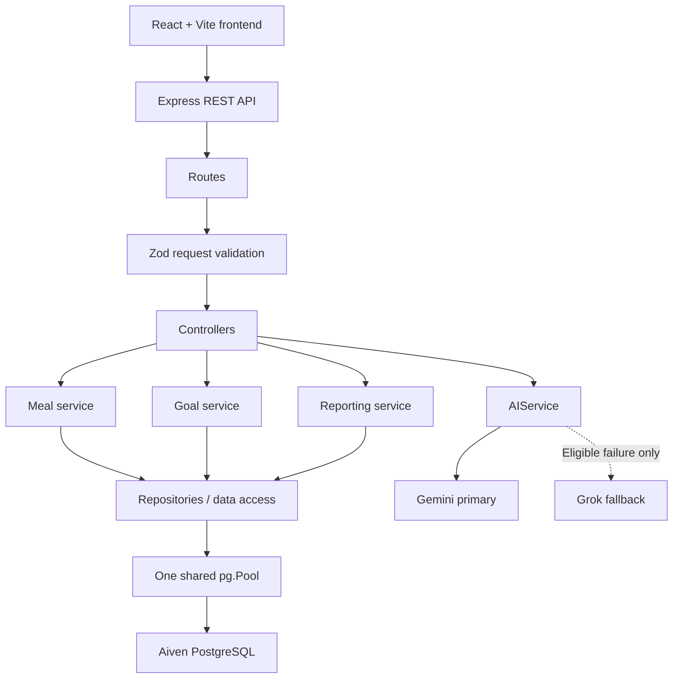
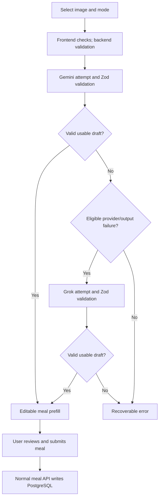

# Personal Calorie Tracker — HLD

Status: reviewed. Implements PRD FR-001–FR-018 and NFR-001–NFR-008 using the user's fixed stack. Meaningful comments are required. This is a design document, not application code or an implementation-phase plan.

## 1. Architecture overview

Use a modular monolith: a React/Vite browser application, a separate Node.js/Express REST API, and Aiven PostgreSQL. Application services own business behavior; repositories own parameterized SQL. The API is the only application-data boundary available to the frontend. There is one shared diary, one current goal configuration, and one persisted singleton profile. No mandatory request includes authentication or account ownership.

Use ordinary JavaScript ES modules and JSX. Prefer named functions and focused feature files over class hierarchies or a dependency-injection framework. React Router provides navigation; Recharts renders server-calculated report data; React Hook Form and Zod support useful form validation. Backend Zod validation is authoritative. Node.js 24 LTS is the selected runtime family; exact dependency versions will be pinned together when implementation is authorized. [Node.js releases](https://nodejs.org/en/about/previous-releases)

## 2. Architecture diagram

The profile read uses the same route/controller/data-access boundary. AI output validation happens inside AIService for each provider attempt. AIService has no meal repository dependency. Accepted suggestions reach PostgreSQL only through a later ordinary meal-create request.

## 3. Frontend responsibilities

| Area | Responsibility |
| --- | --- |
| Meal form | Create/full-edit input, explicit consumed-total nutrition labels, required core fields, nullable micros, date/category/quantity controls. |
| History | Show entries, individual detail/edit links, delete action, and persisted server results. |
| Filters and paging | Keep query state explicit; reset page on filter changes; use server metadata; do not paginate an unbounded download. |
| Goals | Read and replace current targets; preserve blank-as-unset semantics. |
| Reports | Render weekly calorie, day/week macro, micronutrient, and current-target comparison data returned by the server. |
| Image entry | Select mode/file, preliminary checks, upload progress, editable suggestion review, and normal meal save. |
| Application state | Loading, no-data, error, and success states; preserve failed form input; refresh affected views after successful mutations. |

Dashboard uses the same reporting endpoint as Reports. It does not calculate independent totals. Chart bucket pages are visibly identified as pages; full-range summary cards remain full-range. No global state library or client database is required.

## 4. Backend responsibilities

Routes select handlers; Zod validates body/query/params; controllers translate HTTP to service calls; services apply date and domain rules; repositories execute SQL. The backend supports complete meal CRUD, current goals, date context/profile, reports, and image extraction. Central error middleware returns one error contract. Services do not accept client-selected ownership, raw SQL, or provider instructions.

The profile service exposes backend-derived `today`, timezone, and current Monday/Sunday dates. All dynamic date checks use that same definition. Core nutrition in saved meals represents consumed totals; no implicit unit conversion or automatic quantity-based rescaling occurs.

## 5. Database architecture

Use Aiven PostgreSQL through `pg`, parameterized SQL, and ordered SQL migrations. Three domain tables are sufficient: `tracker_profile`, `goals`, and `meals`. The six fixed micronutrients are nullable meal columns; extra nutrient tables add no value for this fixed set. A migration-history table is infrastructure metadata, not an account table.

Initialize one shared `pg.Pool` per backend process. Repositories reuse it; they do not construct new pools or new database connections per HTTP request. Brief client checkout is not a newly constructed connection. Return every checked-out client even when work fails; end the pool during graceful shutdown. [node-postgres pooling](https://node-postgres.com/features/pooling)

Single-row meal/goal writes use one atomic SQL statement. Migrations and any operation involving multiple related writes use an explicit transaction. Two-query list/count and multi-query report reads use a short read-only consistent snapshot. Every transaction uses one checked-out client for its complete lifetime. [node-postgres transactions](https://node-postgres.com/features/transactions)

Use primary keys, singleton checks, field bounds, timestamps, and indexes supporting consumption-date/meal-type order. Aiven connections verify TLS with the service CA. Avoid disabling certificate verification, and keep URL SSL parameters from overriding explicit TLS configuration. [Aiven Node connection guidance](https://aiven.io/docs/products/postgresql/howto/connect-node), [pg SSL configuration](https://node-postgres.com/features/ssl)

## 6. Date architecture

- `consumption_date` is PostgreSQL `DATE` and travels through APIs as `YYYY-MM-DD`.
- `created_at` and `updated_at` are separate `TIMESTAMPTZ` fields, serialized as UTC timestamps.
- Reports and history filters use only consumption date as the diary date.
- The singleton profile starts with `Asia/Kolkata`; backend clock plus that IANA timezone determines today. The browser clock is not authoritative.
- Future consumption dates are rejected on both create and full update.
- Supplied start and end dates are inclusive; weeks run Monday–Sunday.
- Query end dates can extend into future days to display a full calendar week. Those days have no consumed entries and do not count toward elapsed targets.

Prevent `pg`'s default DATE-to-JavaScript-Date behavior from shifting diary dates: configure the DATE parser to preserve calendar-date strings. Calendar arithmetic does not parse consumption dates as local-midnight timestamps. [node-postgres type handling](https://node-postgres.com/features/types)

## 7. Pagination architecture

Every collection uses `page=1` and `page_size=20` by default, with `page_size=100` maximum. Values above 100 are rejected with 422. Filters are applied before count, sorting, offset, and limit. Meal order is consumption date descending, creation timestamp descending, then ID descending.

Return `items` and `pagination` containing page, page_size, total_items, and total_pages. An empty match has total_pages 0; a page beyond the end has empty items but retains the real totals. Report buckets are a collection with the same paging contract and ascending calendar order. Singleton profile/goals and fixed-key nutrient objects are not list endpoints.

Reports aggregate all matching meals first. Bucket paging affects only which chart rows are returned, never the full-range summary. The frontend must not substitute its visible history page for reporting queries.

## 8. AI architecture

AIService coordinates two small provider modules exposing the same conceptual `analyzeNutritionImage` operation. Gemini is primary. Grok is attempted at most once after an eligible Gemini failure. Each attempt includes bounded transport, response extraction, JSON parsing, and Zod validation before any result is used.

| Outcome | Fallback behavior |
| --- | --- |
| Timeout, network/provider unavailable, HTTP 429, provider 5xx | Attempt Grok. |
| Missing/malformed provider response, invalid JSON, provider output failing Zod | Attempt Grok. |
| Valid output identifying unreadable/non-food content | Return a content error; no fallback. |
| Upload/request validation failure | Reject before either provider. |
| Provider refusal/content block | Return a content error; do not try to bypass it. |
| Missing credentials/model, upstream 401/403/404 configuration failure | Return configuration error; do not conceal configuration with fallback. |
| Unexpected application exception, schema-construction bug, unrelated programming error | Central internal error; no Grok fallback. |

Use a 25-second deadline per provider attempt, including body read, a 55-second extraction handler budget after upload, and no automatic provider retries. Manual endpoints do not depend on AI credentials being available. Missing Gemini configuration makes extraction unavailable; the application does not silently become Grok-primary.

Gemini supports inline image input and schema-constrained output; xAI provides image input and structured output. Application Zod validation still defines trust at the boundary. [Gemini images](https://ai.google.dev/gemini-api/docs/image-understanding), [Gemini structured output](https://ai.google.dev/gemini-api/docs/structured-output), [xAI structured output](https://docs.x.ai/developers/model-capabilities/text/structured-outputs)

## 9. AI image flow

Valid drafts can contain missing fields; the user must complete required meal fields before Save. An unreadable/not-food status is a handled domain result. “Usable” does not mean every nutrient is known. The one-entry plate approach avoids duplicate whole-plate and component entries.

## 10. File upload architecture

Accept only `image/jpeg`, `image/png`, `image/webp`, with a maximum of **10 MB = 10,000,000 file bytes**. Exactly the limit passes size validation. Check declared type, actual decoded format, file count, and size before a provider call. Use memory-limited temporary processing; do not create publicly retrievable upload files.

An interoperability issue requires an explicit adaptation: xAI's image documentation lists JPEG and PNG, while this application must also accept WebP. Decode accepted images with Sharp and normalize them to a single bounded JPEG before sending the same image to either provider. Preserve the application's WebP acceptance; do not pass unsupported bytes to Grok. [xAI image input limits](https://docs.x.ai/developers/model-capabilities/images/understanding)

Apply orientation, flatten transparency against white, and bound dimensions while retaining readable label detail. Reject undecodable/animated input and excessive decoded dimensions with a clear error. Release buffers on success, failure, cancellation, or timeout. No persistent provider Files API upload is needed. LLD defines exact limits and cleanup behavior.

## 11. Reporting architecture

One report API returns a full-range summary and a paginated series grouped by day or Monday–Sunday week. This supplies all four report families. The default period is the current complete calendar week; future days are explicitly identified. A requested report range is limited to 366 inclusive calendar days for bounded chart work; longer history remains accessible through the meal list.

Compute in PostgreSQL using consumed totals and consistent dates. Zero-fill missing core logged totals while labeling them as logged data. Group macros independently in grams; do not claim a calorie-share calculation from gram percentages. Return six micronutrient objects with known sum/count/unknown count. Do not use the latest page of meal records or persist independently maintained totals.

Goals are current-only. Read goals and matching meals from one report snapshot. For any selected bucket/range, compare only its dates through today against current daily targets multiplied by the number of those dates. Report this basis explicitly, including for historical ranges. Future-only scopes have no goal comparison. A zero or NULL target yields no percentage. Target weight is displayed separately; it is not converted into nutritional progress.

## 12. Missing micronutrient handling

Nullable columns preserve the fixed distinction: `0` is known zero and `NULL` is unknown. SQL sums ignore unknown rows, so each nutrient also includes `known_count`, `unknown_count`, and `entry_count`. When known_count is zero, return known_total NULL. Never coalesce an all-unknown micronutrient total to zero.

Keep these rules in one report mapping and the shared UI nutrient-field configuration. React form blanks explicitly become null. Backend JSON-body schemas do not coerce null or blank strings to numbers. Comments must explain the sum/count pairing and why blank-to-zero conversion is prohibited.

## 13. Error-handling strategy

Use one error envelope with a stable code, readable message, field details, and request ID. Map invalid requests/dates, missing records, upload errors, database unavailable, provider/output failure, and unexpected exceptions explicitly. Log diagnostic codes server-side with request IDs; do not log secrets, uploaded image bytes, or full user nutrition payloads by default.

Central Express error middleware runs after routes; asynchronous failures propagate to it. The frontend API client parses errors once, preserves forms, and supplies retry/manual-entry options according to the operation. It does not automatically retry create/delete/save requests. [Express error handling](https://expressjs.com/en/guide/error-handling/)

## 14. Security boundaries

Keep all database/provider keys in backend environment configuration. Use parameterized SQL, backend type/size/content upload checks, Helmet, explicit CORS origin, bounded JSON bodies, and rate limits on image analysis. Uploaded text is data, not executable instructions. AIService has no database mutation capability. [Express security guidance](https://expressjs.com/en/advanced/best-practice-security/)

Authentication is absent from the mandatory architecture. CORS/Helmet/rate limiting do not make the diary private. Run a personal deployment on a restricted network or use an explicitly authorized external access boundary; a public evaluation demo should use synthetic data. This is a deployment limitation, not a new application-authentication requirement.

## 15. Deployment architecture

Build the React application as static assets on a generic frontend host. Run Express as a separate long-lived Node service. Both use HTTPS when remotely hosted. Express alone connects to Aiven over verified TLS and to AI providers over HTTPS. Configure frontend API base URL and backend client origin consistently.

Use one backend process for the take-home deployment, making the in-memory AI limiter/concurrency bound and shared pool straightforward. No Redis, queue, object store, orchestration platform, or additional database is required. The deployment provider is intentionally unspecified. Migrations run as an explicit setup/release action and do not destroy records at application startup.

## 16. Architectural decisions and tradeoffs

| Decision | Reason and consequence |
| --- | --- |
| Modular monolith | One readable backend with real feature boundaries; no distributed-system overhead. |
| Fixed React/Express/PostgreSQL stack | Follows the user's technology choices and keeps APIs separate. |
| Aiven and one pg.Pool | Managed persistent data with bounded reused connections. |
| Zod at API/provider boundaries | One authoritative validation policy; frontend checks remain UX aids. |
| Consumed-total meal model and full PUT updates | Explicit meaning, simple schema, and complete edit review; quantity edits do not auto-rescale. |
| Six nullable micronutrient columns | Easy to explain/query; expanding the set later requires a migration. |
| Current-only goals | Simple singleton model; historical charts clearly compare with current targets. |
| Server-side complete-data reporting | Correct totals independent of all UI paging. |
| Editable AI suggestions | User controls the consumed record and unknown/estimated values. |
| Gemini/Grok modules with narrow fallback | Isolates vendor details without masking application defects. |
| JPEG normalization for providers | Satisfies WebP uploads while retaining Grok compatibility. |
| Single-user baseline | No account tables, tokens, or owner filters; public access is not private. |
| Required comments and simple functions | Explain non-obvious decisions without unnecessary abstraction or commentary noise. |
